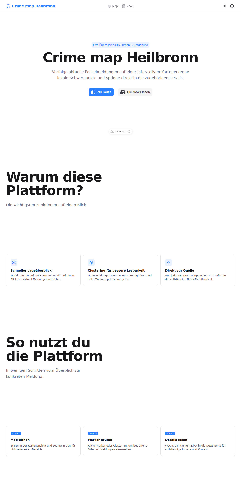

<div align="center">
  <h1>Crime Map Heilbronn 🗺️🚨</h1>
  <p>Eine interaktive Karte für die Stadt und den Landkreis Heilbronn, welche die Kriminalstatistiken und Vorfälle basierend auf aktuellen Polizei-Pressemitteilungen visualisiert.</p>

  <!-- Badges -->
  <p>
    <a href="https://github.com/miggi92/crime-map-hn/actions"></a>
    <a href="https://nuxt.com/"></a>
    <a href="https://vuejs.org/"></a>
    <a href="https://hub.nuxt.com/"></a>
    <a href="https://github.com/miggi92/crime-map-hn/blob/main/LICENSE"></a>
  </p>

  
</div>

---

## 📖 Über das Projekt

Dieses Projekt sammelt polizeiliche Pressemitteilungen und stellt die darin enthaltenen Vorfälle auf einer Karte dar. Ziel ist es, Entwicklungen und Hotspots im Stadt- und Landkreis Heilbronn anschaulich zu machen. Geplant ist zudem, in Zukunft noch weitere Datenquellen anzubinden.

## 🛠️ Tech Stack

Das Projekt nutzt modernste Web-Technologien und ist für das Deployment am Edge (Cloudflare Workers via NuxtHub) optimiert:

- **Framework:** [Nuxt 4](https://nuxt.com/) (inklusive [Nuxt UI](https://ui.nuxt.com/)) & [Vue 3](https://vuejs.org/)
- **Map:** [Leaflet](https://leafletjs.com/) (via `@vue-leaflet/vue-leaflet`) mit Marker-Clustering
- **Testing:** [Vitest](https://vitest.dev/) (Unit Tests) & [Playwright](https://playwright.dev/) (E2E Tests)
- **Deployment:** [NuxtHub](https://hub.nuxt.com/) auf Cloudflare Workers

---

## 💻 Entwicklung (Development)

### Voraussetzungen

Stelle sicher, dass [Node.js](https://nodejs.org/) und [pnpm](https://pnpm.io/) installiert sind.

### Setup

Abhängigkeiten installieren:

```bash
pnpm install
```

### Development Server

Starte den lokalen Entwicklungsserver:

```bash
pnpm dev
```
Der Server läuft anschließend auf `http://localhost:3000`.

### Production Build & Preview

Um die Anwendung für die Produktion zu bauen (Edge-kompatibel):

```bash
pnpm build
```

Den Build lokal testen:

```bash
pnpm preview
```

> **Hinweis zur lokalen Edge-Simulation:** Um die Cloudflare Edge Umgebung lokal zum Debuggen zu simulieren, kannst du folgenden Befehl nutzen:
> `NODE_OPTIONS="--max-old-space-size=4096" NITRO_PRESET=cloudflare pnpm build`
> gefolgt von `npx wrangler dev .output/server/index.mjs --site .output/public`

---

## 🧪 Testing

Dieses Projekt nutzt Vitest für Unit-Tests und Playwright für End-to-End Tests.

- **Unit Tests:** `pnpm test:unit`
- **Unit Tests (mit Coverage):** `pnpm test:coverage`
- **E2E Tests:** `pnpm test:e2e`

---

## 🤝 Mitwirken (Contributing)

Beiträge sind jederzeit willkommen! Da es sich um ein Open-Source-Projekt handelt, freuen wir uns über Pull Requests, Feature-Vorschläge oder Bug Reports.

1. Repository forken
2. Feature-Branch erstellen (`git checkout -b feature/NeuesFeature`)
3. Änderungen committen (`git commit -m 'Add NeuesFeature'`)
4. Branch pushen (`git push origin feature/NeuesFeature`)
5. Pull Request eröffnen

---

## 📄 Lizenz

Dieses Projekt ist unter der **MIT License** lizenziert. Weitere Details findest du in der [LICENSE](LICENSE) Datei.